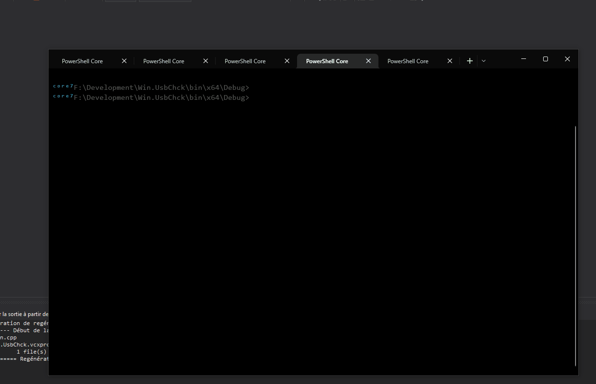

# Win.UsbChck

___Win.UsbChck___ is a Proof-of-Concept tool I made for automatically detecting usb devices connections and running a script with the new drive letter as argument when a device connection occurs.

## Usage


Have a batch file containing the code you want for example:

```
    SET DRIVE=%1
    echo SCANNING DRIVE %DRIVE%...
    C:\Windows\system32\chkdsk.exe %DRIVE%:
```
Povided script at [this location](https://github.com/arsscriptum/Win.UsbChck/blob/master/scripts/scan.bat)

Run this:

```
    c:\TOOLS>usbchck.exe c:\TOOLS\scan.bat
```

<p align="center">
  
</p>
